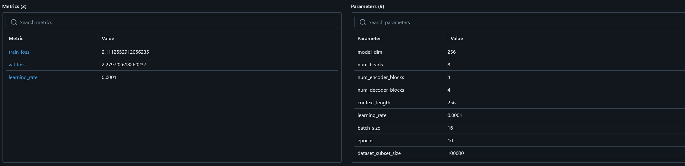
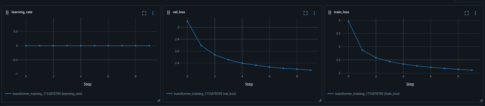
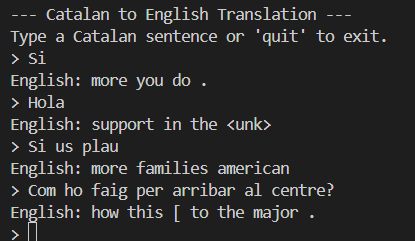

# ⚽ Catalanformer

A **from-scratch reimplementation** of the seminal paper _"Attention Is All You Need"_ by Vaswani et al. (2017), applied to a real-world use case: translating **Catalan to English**. This project is both a deep dive into the mechanics of the Transformer architecture and a practical solution for understanding FC Barcelona's multilingual content.

---

## 🎯 Project Objective

The primary goal of this project is to **faithfully reconstruct the original Transformer architecture**—without relying on high-level libraries, using only PyTorch—and demonstrate its capabilities through a focused translation task. The use case is inspired by my personal interest in FC Barcelona, whose social media posts and videos often appear in Catalan.

---

## 🏛️ Architecture Deep Dive
This project implements the standard **Encoder-Decoder** architecture proposed in the original paper. The model is designed to process a sequence of text in a source language (Catalan) and generate a corresponding sequence in a target language (English).

### Encoder
The Encoder's job is to read the input Catalan sentence and build a rich, contextual numerical representation of it. It consists of a stack of N=4 identical layers. Each layer has two main sub-components:

- Multi-Head Self-Attention: This is the core mechanism of the Transformer. It allows each word in the input sentence to look at all other words in the same sentence, weighing their importance to build a better representation of itself.

- Position-wise Feed-Forward Network: A simple fully connected neural network applied independently to each position in the sequence.

- Each sub-layer is followed by a residual connection and a layer normalization step (a "Post-Norm" architecture), which helps stabilize the training of deep networks.

### Decoder
The Decoder's job is to take the encoded representation of the Catalan sentence and generate the English translation, word by word. It also consists of a stack of N=4 identical layers. Each layer has three sub-components:

- Masked Multi-Head Self-Attention: This is similar to the encoder's self-attention, but with a crucial difference: it's "masked" to prevent any position from attending to future positions. This ensures that when predicting the next word, the model can only use the words it has already generated.

- Encoder-Decoder Cross-Attention: This is where the magic happens. The decoder focuses on the output of the encoder, allowing it to look at the entire source sentence and decide which parts are most relevant for generating the next English word.

- Position-wise Feed-Forward Network: Identical to the one in the encoder.

- Like the encoder, each sub-layer uses residual connections and layer normalization.

## Similarity to the Original Architecture
This implementation is highly faithful to the original "Attention Is All You Need" paper:

It uses the same Encoder-Decoder stack.

It employs Multi-Head Attention as the core building block.

It uses Position-wise Feed-Forward Networks.

It relies on residual connections and layer normalization.

The primary difference is the method of positional encoding. While the original paper used fixed sinusoidal functions, this project uses learned Positional Embeddings (nn.Embedding). This is a common and effective modern variation that allows the model to learn the optimal positional representations from the data itself.

---

## ⚙️ Training Process
The model was trained on a parallel corpus of over 1 million Catalan-English sentence pairs (Originally 2.3 million, reduced for training purpose on limited compute power system).

### Data Preprocessing
- Tokenization: The raw text is processed using SpaCy tokenizers for both Catalan and English.

- Vocabulary Creation: A vocabulary is built for each language from the training split, capped at the 25,000 most frequent tokens.

- Numericalization: Each sentence is converted into a sequence of numerical IDs, with special tokens for <pad>, <sos> (start of sentence), and <eos> (end of sentence).

### Model Training
The training was conducted on a single NVIDIA RTX 4070 Laptop GPU.

- Hyperparameters: The model was trained with a dimension of 256, 8 attention heads, and 4 encoder/decoder blocks.

- Optimizer: The AdamW optimizer was used with a learning rate of 1e-4.

- Loss Function: CrossEntropyLoss was used, configured to ignore the padding token ID during loss calculation.

- Learning Rate Scheduler: A ReduceLROnPlateau scheduler was implemented to automatically reduce the learning rate if the validation loss did not improve for 2 consecutive epochs, allowing for more stable convergence.

### Experiment Tracking with MLFlow
All training runs were logged using MLFlow. This allowed for systematic tracking of hyperparameters, metrics (training and validation loss), and the saving of the best-performing model as a logged artifact.

---

## 📊 Results
After training on a subset of the data, the model began to show clear signs of learning, with both training and validation loss steadily decreasing over the epochs.

The resulting model is capable of generating coherent, albeit simple, translations for common Catalan phrases.

While not state-of-the-art, this project successfully demonstrates a deep, from-scratch understanding of the Transformer architecture and its application to a practical machine translation task.

---

## 🖼️ Visual Overview

### Model Metrics and Parameters

### Training Metrics

### Translation Example

---